# ParkSys 🚗

Sistema de gestao de estacionamento desenvolvido em Java para a disciplina **ARQDEOO** do Instituto Federal de Sao Paulo, Campus Araraquara.

O ParkSys permite controlar vagas, registrar entrada e saida de veiculos, cadastrar mensalistas, calcular valores de estadia, acompanhar relatorios, persistir dados em arquivo serializado e demonstrar conceitos de multithreading e padroes de projeto.

## Funcionalidades

- Cadastro de veiculos avulsos por placa, tipo de veiculo e vaga desejada.
- Cadastro de mensalistas com vaga reservada e mensalidade fixa definida pelo sistema.
- Registro de saida por placa, com calculo automatico para clientes avulsos.
- Controle de vagas livres, ocupadas e reservadas.
- Suporte a veiculos que ocupam mais de uma vaga.
- Monitor visual de vagas com selecao de vaga pelo mapa.
- Relatorio Swing com abas para registros do dia, receita decrescente, avulsos e mensalistas.
- Exportacao de relatorio em arquivo `.txt`.
- Persistencia dos dados com serializacao.
- Demonstracao de multithreading com `Thread`, `Runnable`, `synchronized` e daemon.
- Aplicacao dos padroes Singleton e Observer.

## Regras principais

O estacionamento possui **30 vagas**, distribuidas em duas fileiras:

- Fileira `A`: vagas `A01` ate `A15`
- Fileira `B`: vagas `B01` ate `B15`

Tipos de veiculo:

| Tipo | Tarifa por hora | Vagas ocupadas |
| --- | ---: | ---: |
| Motocicleta | R$ 5,00 | 1 |
| Automovel | R$ 10,00 | 1 |
| Caminhonete / SUV | R$ 18,00 | 2 |
| Caminhao | R$ 30,00 | 3 |

Clientes mensalistas possuem valor fixo de mensalidade. A entrada e saida do mensalista nao geram cobranca por hora; a receita do mensalista e contabilizada pela mensalidade fixa no relatorio.

## Estrutura de pacotes

```text
src/
└── parksys/
    ├── entities/
    │   ├── Mensalista.java
    │   ├── Registro.java
    │   ├── Vaga.java
    │   └── Veiculo.java
    ├── enums/
    │   ├── StatusVaga.java
    │   └── TipoVeiculo.java
    ├── exceptions/
    │   ├── PlacaInvalidaException.java
    │   ├── VagaOcupadaException.java
    │   └── VeiculoNaoEncontradoException.java
    ├── main/
    │   └── Principal.java
    ├── observer/
    │   ├── EstacionamentoObserver.java
    │   └── PainelMonitor.java
    ├── services/
    │   ├── DadosParkSys.java
    │   ├── EntradaRunnable.java
    │   ├── GerenciadorArquivo.java
    │   ├── GerenciadorEstacionamento.java
    │   └── MonitorRunnable.java
    └── ui/
        ├── FormularioHelper.java
        ├── PainelDesenhoVeiculo.java
        ├── TelaCadastroMensalista.java
        ├── TelaInicial.java
        ├── TelaRegistroEntrada.java
        ├── TelaRelatorio.java
        └── TelaSaida.java
```

## Responsabilidades por pacote

| Pacote | Responsabilidade |
| --- | --- |
| `parksys.entities` | Representa as entidades do dominio do estacionamento. |
| `parksys.enums` | Concentra enumeracoes com dados de negocio. |
| `parksys.exceptions` | Define excecoes customizadas do dominio. |
| `parksys.services` | Implementa regras de negocio, persistencia, arquivos e threads. |
| `parksys.observer` | Implementa o padrao Observer e o monitor de vagas. |
| `parksys.ui` | Contem as telas Swing e componentes visuais. |
| `parksys.main` | Demonstra recursos de threads e inicia a aplicacao. |

## Como executar o projeto do zero

### 1. Clonar o repositorio

No terminal, escolha uma pasta para salvar o projeto e execute:

```powershell
git clone https://github.com/ellengoncalves/ParkSys.git
cd ParkSys
```

### 2. Verificar o Java

O projeto foi desenvolvido para ser compativel com Java 8 ou superior.

Ambiente usado no desenvolvimento:

```text
java 1.8.0_401
javac 21.0.8
```

Para verificar a versao instalada na sua maquina:

```powershell
java -version
javac -version
```

Se o comando `javac` nao for reconhecido, instale um JDK e configure a variavel `PATH`.

### Rodar pelo terminal

Ao clonar o projeto, a pasta `out/` ainda nao existe. Por isso, no terminal, primeiro e necessario compilar o codigo e depois executar a aplicacao.

No PowerShell, com JDK 9 ou superior, compile com:

```powershell
javac --release 8 -encoding UTF-8 -d out (Get-ChildItem -Path src -Recurse -Filter *.java).FullName
```

Se estiver usando JDK 8, use:

```powershell
javac -encoding UTF-8 -d out (Get-ChildItem -Path src -Recurse -Filter *.java).FullName
```

Depois de compilar, execute a tela inicial:

```powershell
java -cp out parksys.ui.TelaInicial
```

Para demonstrar os requisitos de multithreading pelo terminal, execute:

```powershell
java -cp out parksys.main.Principal
```

A classe `Principal` executa uma simulacao com threads antes de abrir a interface grafica.

### Rodar por uma IDE

1. Clone o repositorio.
2. Abra a pasta `ParkSys` na IDE.
3. Configure um JDK 8 ou superior.
4. Marque a pasta `src` como pasta de codigo-fonte, se a IDE nao fizer isso automaticamente.
5. Clique com o botao direito na classe desejada e selecione `Run Java`, `Run` ou opcao equivalente.

Para usar o sistema normalmente, execute:

```text
parksys.ui.TelaInicial
```

Para demonstrar os requisitos de threads, execute:

```text
parksys.main.Principal
```

## Persistencia de dados

Os dados da aplicacao sao salvos em:

```text
dados/parksys.ser
```

O arquivo e gerado automaticamente e nao deve ser versionado. Por isso, `dados/`, `relatorios/`, `*.ser` e arquivos de build estao no `.gitignore`.

Para iniciar o sistema sem dados locais, apague:

```text
dados/parksys.ser
```

Ao clonar o projeto pelo GitHub, o sistema inicia sem registros cadastrados, pois os arquivos serializados nao fazem parte do repositorio.

## Conceitos aplicados

### Enums

- `TipoVeiculo` define descricao, tarifa por hora e quantidade de vagas ocupadas.
- `StatusVaga` define descricao e disponibilidade da vaga.

### Collections

- `HashMap<String, Vaga>` para acesso rapido as vagas pelo codigo.
- `ArrayList<Registro>` para armazenar registros de entrada e saida.
- `LinkedList<Mensalista>` para insercoes e remocoes frequentes nas pontas.
- `TreeSet<Registro>` para ordenacao cronologica crescente.
- `Comparator` para ordenar registros por receita decrescente.

### Serializacao e arquivos

- Entidades principais implementam `Serializable`.
- `Registro.threadOrigem` e `transient`, pois representa informacao temporaria de execucao.
- `GerenciadorArquivo` usa `try-with-resources`.
- O sistema serializa e desserializa dados com `DadosParkSys`.
- O relatorio pode ser exportado em `.txt`.

### Multithreading

- `EntradaRunnable` simula entradas concorrentes.
- `MonitorRunnable` acompanha o estado das vagas em uma thread daemon.
- Metodos criticos do `GerenciadorEstacionamento` usam `synchronized`.
- O codigo contem comentario explicando o risco de race condition sem sincronizacao.

### Padroes de projeto

- Singleton em `GerenciadorEstacionamento`, acessado por `getInstance()`.
- Observer com `EstacionamentoObserver` e `PainelMonitor`.
- Separacao por camadas entre entidades, servicos, observer e interface Swing.

### Interface Swing

- `TelaInicial` centraliza as operacoes principais.
- `TelaRegistroEntrada` registra veiculos avulsos e mensalistas.
- `TelaSaida` finaliza registros por placa.
- `TelaCadastroMensalista` cadastra clientes mensalistas com mensalidade fixa.
- `TelaRelatorio` exibe tabelas de registros, avulsos, mensalistas e receitas.
- `PainelMonitor` mostra visualmente o estado das vagas.

## Dados usados na demonstracao

Para reproduzir as telas exibidas abaixo, comece com o sistema limpo. Se houver dados locais antigos, apague:

```text
dados/parksys.ser
```

### Mensalistas

| Nome | Documento | Telefone | Placa | Tipo de veiculo | Vaga reservada | Status demonstrado |
| --- | --- | --- | --- | --- | --- | --- |
| Ana Souza | 123.456.789-00 | 16123456789 | ELL1234 | Caminhao | B02 | Finalizado |
| Frederico Alves | Nao informado | Nao informado | ABC1212 | Motocicleta | A02 | Reservado |

Resultado esperado:

- Ana Souza ocupa `B02-B04` ao registrar entrada, pois o caminhao ocupa 3 vagas.
- Ao registrar a saida de `ELL1234`, o registro fica finalizado com valor `R$ 0,00`, pois mensalista nao paga por hora.
- Frederico Alves permanece apenas reservado na vaga `A02`, sem registro de entrada.
- A mensalidade fixa aparece no relatorio para os dois mensalistas.

### Entradas avulsas

| Placa | Tipo | Vaga |
| --- | --- | --- |
| AUT1111 | Automovel | A01 |
| CAM3I45 | Caminhonete / SUV | A05 |

Resultado esperado:

- `AUT1111` aparece como avulso finalizado com valor calculado por hora.
- `CAM3I45` aparece como avulso em aberto, ocupando `A05-A06`.

### Entrada e saida do mensalista

Ao informar a placa `ELL1234` na tela de entrada, o sistema identifica o mensalista Ana Souza e preenche automaticamente o tipo de veiculo e a vaga reservada.

Na saida, o registro do mensalista fica com valor `R$ 0,00`, pois nao ha cobranca por hora. A mensalidade fixa continua aparecendo no relatorio.

## Demonstracao visual

### Tela inicial

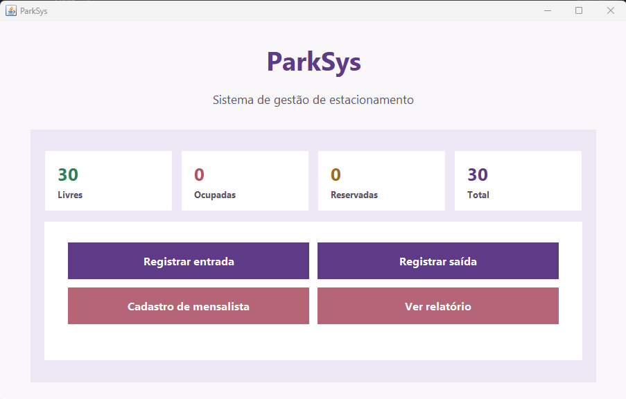

### Cadastro de mensalista

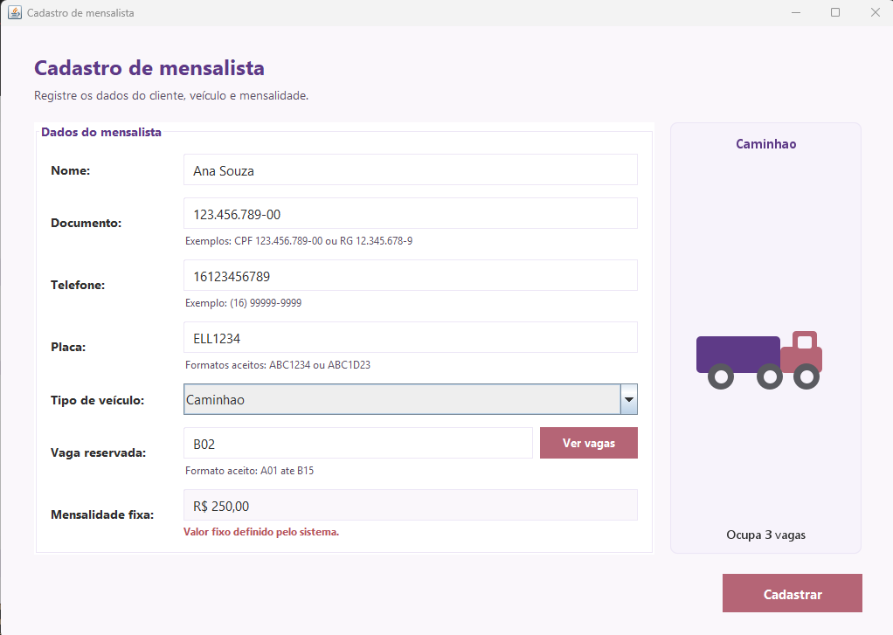

### Registro de entrada

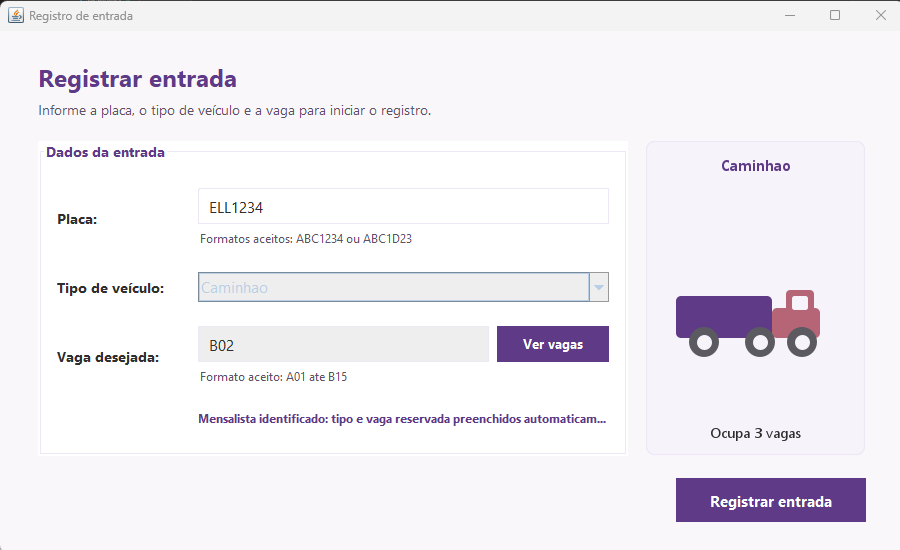

### Registro de saida

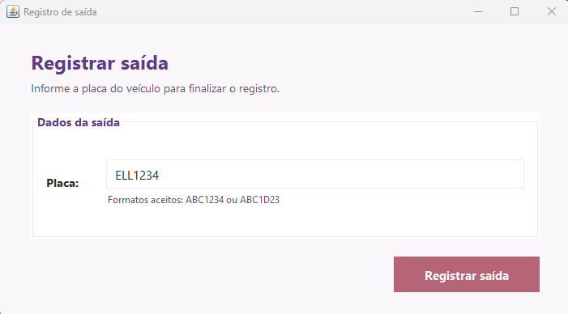

### Monitor de vagas

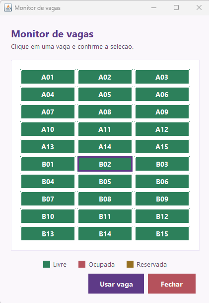

### Relatorio: registros do dia

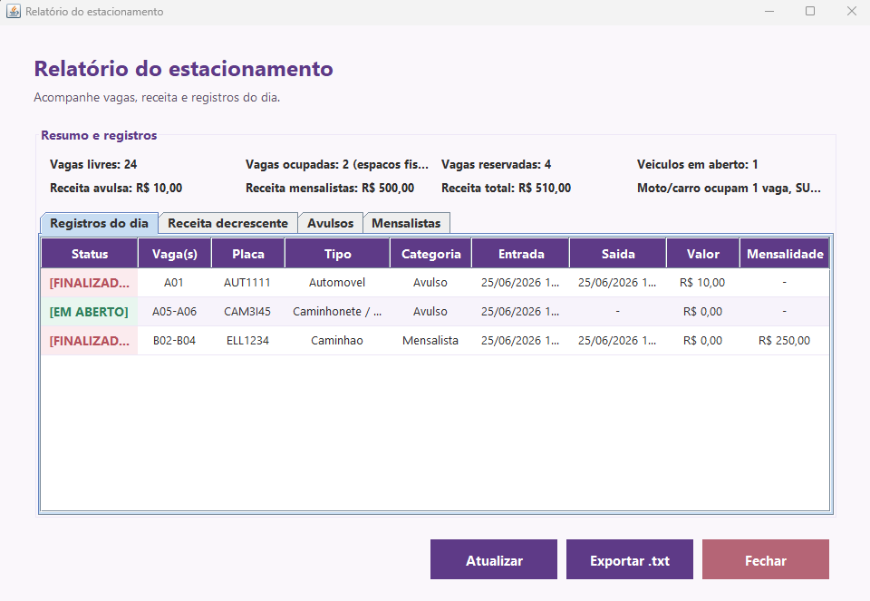

### Relatorio: receita decrescente

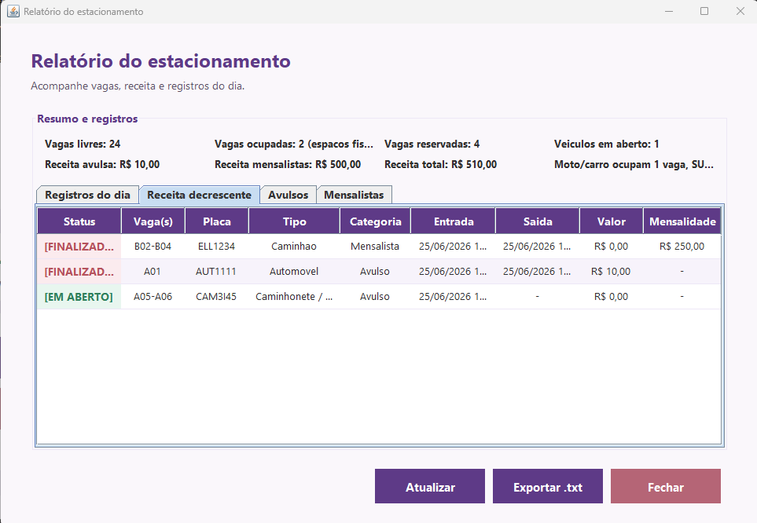

### Relatorio: avulsos

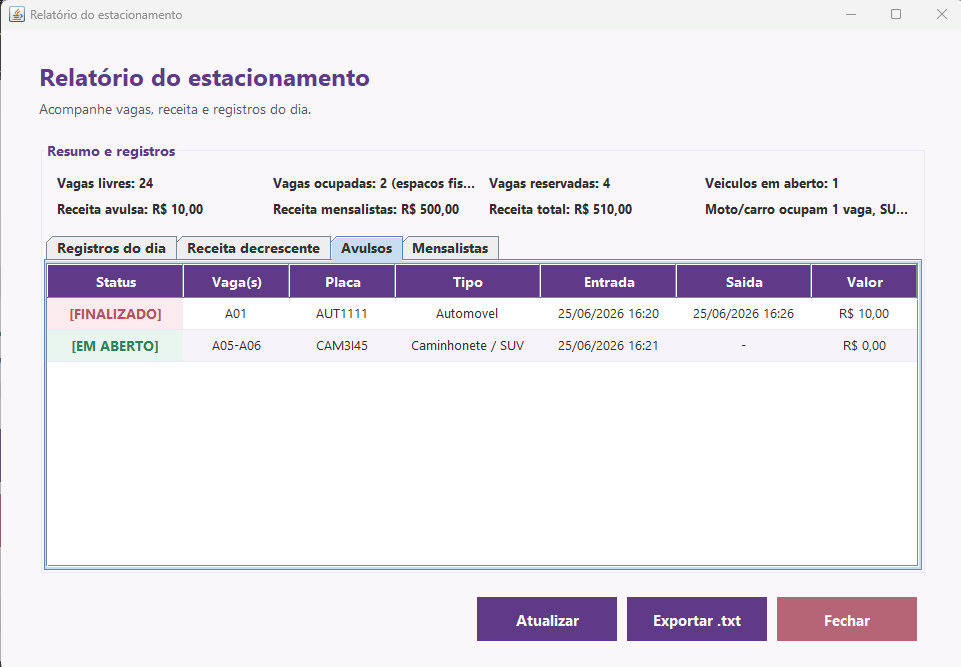

### Relatorio: mensalistas

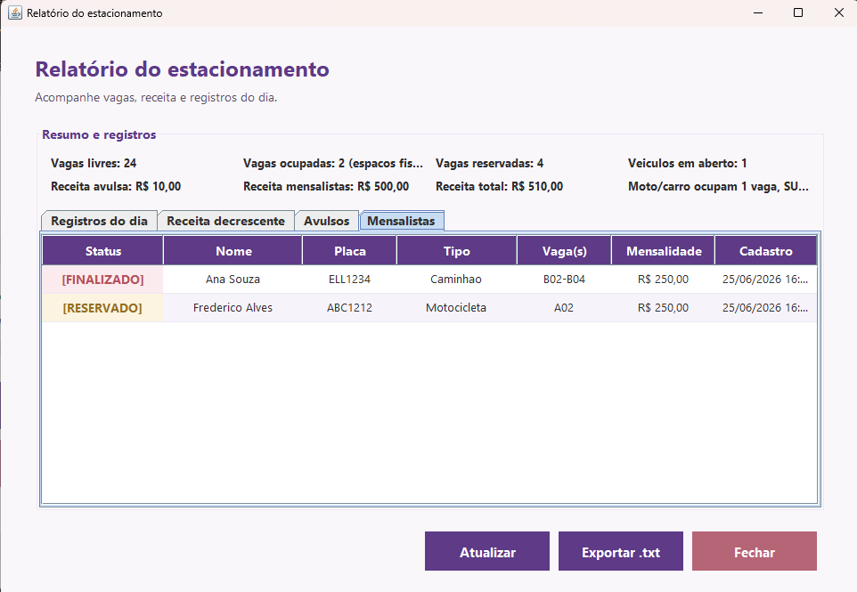

### Exportacao TXT: confirmacao

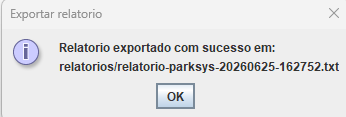

### Exportacao TXT: arquivo gerado

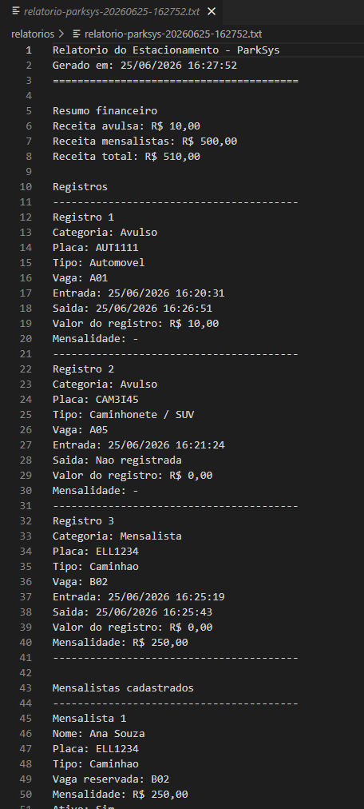

## Autoras

- Ellen Pinheiro Goncalves
- Ariane Minguini Sanga

Disciplina: ARQDEOO  
Professor: Junior Fernandes Marques  
Instituto Federal de Sao Paulo, Campus Araraquara
